### Cisco Unified Communications Admin Guide

# Users

💫 There are two types of users: Application users and End Users. We&#39;ll focus on **End Users**.

Users who have an **ipPhone** are synched every 6 hours (or manually) from LDAP Directory

#### 👉 System \> LDAP \> LDAP Directory

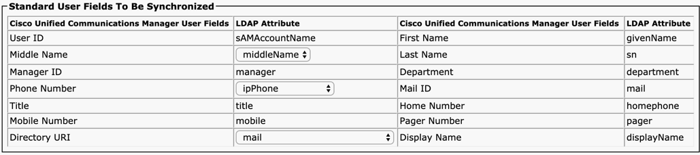

LDAP users have limited number of editable fields in CUCM and authenticate directly to LDAP.

When end users are imported, they use **Feature Group Template** to specify their feature set.

#### 👉 User Management \> User/Phone Add \> Feature Group Template

This is useful as you can manage feature sets in LDAP. You would create multiple LDAP Directories with different filters and apply relevant **Feature Group Templates** to each.

When users are imported, they can have **Access Control Groups** assigned.

- Standard CCM End Users – Grants an end user log-in rights to the Cisco Unified CM User Options page
- Standard CTI Enabled – Enabled CTI application control (allows users to control their desk phones)

For more information on **user roles** :

[https://www.cisco.com/c/en/us/td/docs/voice\_ip\_comm/cucm/admin/9\_0\_1/ccmsys/CUCM\_BK\_CD2F83FA\_00\_cucm-system-guide-90/CUCM\_BK\_CD2F83FA\_00\_system-guide\_chapter\_0100.pdf](https://www.cisco.com/c/en/us/td/docs/voice_ip_comm/cucm/admin/9_0_1/ccmsys/CUCM_BK_CD2F83FA_00_cucm-system-guide-90/CUCM_BK_CD2F83FA_00_system-guide_chapter_0100.pdf)

End users can be managed from the End User Configuration Page:

#### 👉 User Management \> End User

The **Name** and **Telephone Number** here is what is listed in the **Corporate Directory** and applications such as Jabber.

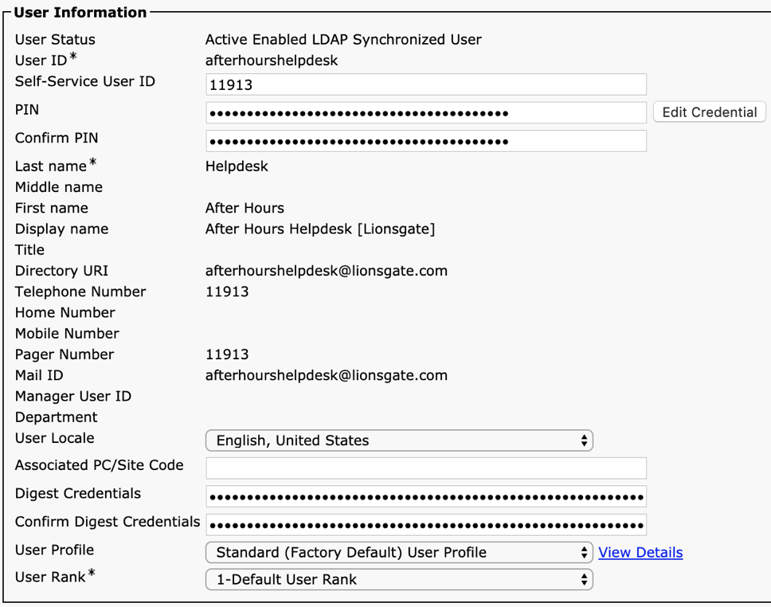

**Home cluster** should be checked for all users.

💫 in a multi-cluster environment, you would have End Users synchronized to ALL clusters for directory purposes and homed in exactly ONE cluster for registration.

**Enable User for IM and Presence** should be checked for all Jabber users.

**Device Association** is required for desk phone control and attendant console

**Line Appearance for Presence** determines which lines are monitored for Jabber and BLF Call lists.

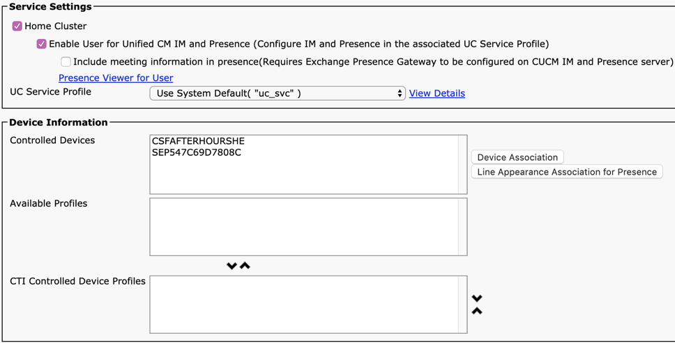

**Extension Mobility** allows users to login to any phone and bring over their settings. After creating a User Profile, you would need to associate it here.

**BLF Presence Group** and **SUBSCRIBE Calling Search Space** can be used to limit the ability for one coworker to see the presence of another coworker. This is used for Jabber and call lists on the phone to show a green dot for available peers and a red dot for unavailable peers.

**Allow Control of Device from CTI** is required for desk phone control from an application such as Jabber.

**Directory Number Association** becomes available once the Device is associated and specifying a number here associates the users&#39; Directory URI to the number.

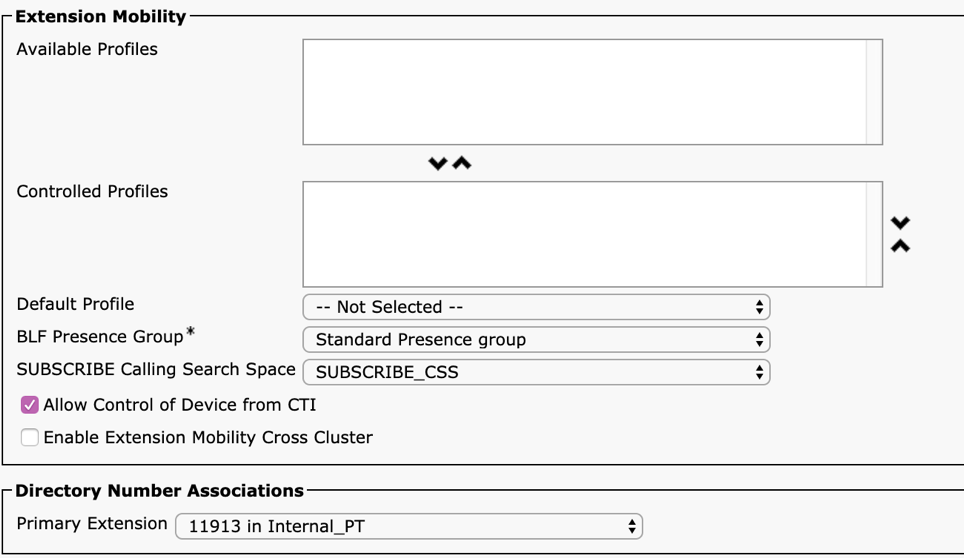

**Mobility** should be checked to allow the user to use an RDP, aka Single Number Reach

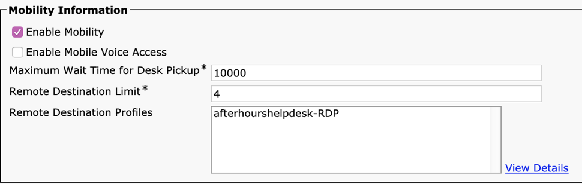

Permissions below have been specified in LDAP Directory and are recommended for End Users

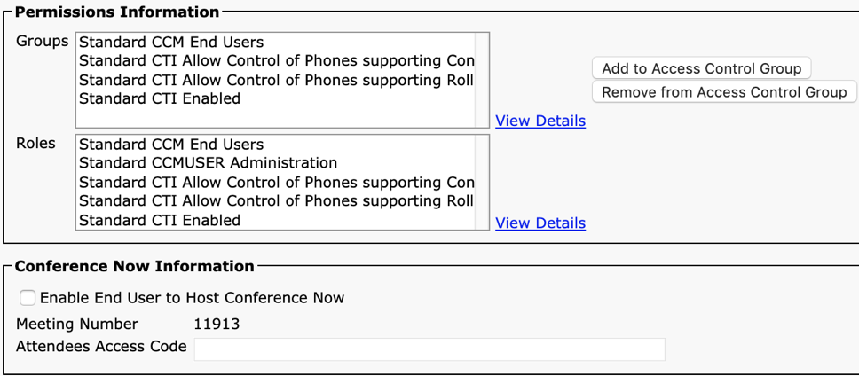

🎟 End users should also be specified as Owner on the device for licensing purposes

# Devices

Devices are desk phones, conference phones and soft phones and can be categories by the first 3 letters

- **SEP** followed by a MAC Address of the phone are desk phones
- **CSF** followed by the username are Jabber soft phone clients
- **TCT, BOT and TAB** are for legacy Jabber devices that are no longer needed

💫 Phones can be filtered on many things but the most common are:

- Description contains &quot;UK Phone 31001&quot;
- Directory Number begins with &quot;3&quot; or contains &quot;31001&quot;
- Device Pool begins with &quot;UK&quot;
- Device Name begins with &quot;CSF&quot;

#### 👉 Device \> Phone

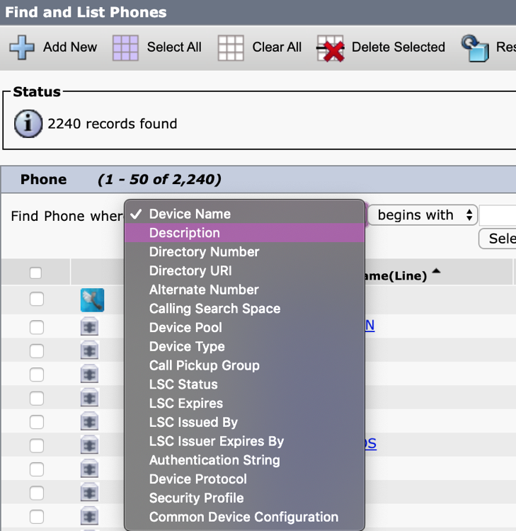

##### Phone Configuration

| | |
| --- | --- |
| Description | Helpdesk – John Doe - 12003 |
| Device Pool | Controls where the phone registers, which gateway and media resources it uses and other settings |
| Phone Button Template | Specifies the purpose for each button: line, speed dial, etc. This is particularly important when bulk importing phones as the import file headers need to match the template. |
| Softkey Template | Specifies what functions are available and in what order when in different call states using the softkeys. |
| Calling Search Space | Specifies the calling rights of a phone. When calling search spaces are applied to both Device and Line, the two are combined with Line taking precedence.  A common practice is to allow all patterns at the device level and restrict patterns at the line level, such as international |
| Media Resource Group List | Recommended to leave at None and specify on the Device Pool |
| User MOH Audio Source | Music when a call is placed on hold |
| Network Hold MOH Audio Source | Music when a call is being transferred or held indirectly when adding a conference participant |
| Location | Used when call admission control is enabled. |
| Network Locale | Describes the ring back tone heard. Should be set to what the caller is used to hearing for their country. |
| Owner User ID | Used for licensing purposes. CUWL licensing allows users to have multiple phones. Phones without an owner do not provide the best use of licensing |
| Mobility User ID | Used for Single Number reach |
| Remote Number | Can be used to control what number is displayed on the phone when outbound called party transformations may alter the display. |
| Device Security Profile | The standard profile should be used unless the cluster uses encryption between endpoints (mixed mode) in which case the subject name in the profile must be set to the subject name of the certificate to be validated. |
| SUBSCRIBE Calling Search Space | Specifies the lines that can be monitored via BLF call lists |
| SIP Profile | Standard profile should be used in most cases |
| Digest User | Used in registration of 3rd party sip devices |
| Settings Access | Controls whether Settings shows up on the phone |
| Web Access | Controls whether the web interface is listening and is required for remote control of devices through CTI |
| Headset Hookswitch Enabled | Required for headsets to work |
| User Credentials Persistent for Expressway Login | If set, MRA users will not have to enter their credentials every time |

##### Line Configuration

|  |  |
| --- | --- |
| Directory Number | Directory Number is unique per Route Partition |
| Route Partition | Specifies patterns with the same reachability. Directory Numbers without a route partition (Null partition) are reachable from any device and should be avoided at all costs! |
| Description | John Doe - 12001 |
| Alerting Name / ASCII Alerting Name | Caller ID per Line |
| Associated Devices | A list of devices the directory number+partition exists on |
| Voice Mail Profile | Which voicemail profile the phone will use. If left to None, will use the system default. |
| Calling Search Space | Specifies the calling rights of the line. |
| Auto Answer | If set to yes, the phone will automatically answer any calls without user intervention. Often used as a secondary line for a 2-way intercom system. |
| Enterprise Alternate Number | When enabled, advertises the directory number to other clusters in the ILS network, added to its &quot;Global Learned Enterprise Numbers&quot; partition |
| +E.164 Alternate Number | When enabled and added to a partition reachable from the PSTN, allows for reachability from outside the phone system (PSTN) |
| Forward All | When checked, sends all calls to voicemail. When filled out and unchecked, sends all calls to destination specified. |
| Forward Busy | When checked, sends busy calls to voicemail. When filled out and unchecked, sends all busy calls to destination specified.  |
| Forward No Answer | When checked, sends unanswered calls to voicemail. When filled out and unchecked, sends unanswered calls to destination specified.  |
| No Answer Ring Duration | If specifies, overrides the system default number of rings before sending to no answer destination |
| Display / ASCII Display | Caller ID per Line Appearance. Takes precedence over Alerting Name when both exist. Used for shared lines. |
| Line Text Label | The text shown on the phone button itself, ie:John - 11004 |
| External Phone Number Mask | Specifies PSTN number the phone dials out as |
| Ring Setting | Can be set to flash only in situations where a line should be on a phone as an overflow, or for mostly outbound use, but shouldn&#39;t ring.   |
| Maximum Number of Calls | Total number of calls allowed across all line appearances |
| Busy Trigger | Total number of calls allowed across all line appearances before following busy path |
| Forwarded Call Information Display | Specifies what fields are carried when forwarding a call. Set to Caller Name and Dialed Number typically. |

# Bulk Administration

## Update Phones

#### 👉 Bulk Administration \> Phones \> Update Phones \> Query

 Query the phones you wish to update

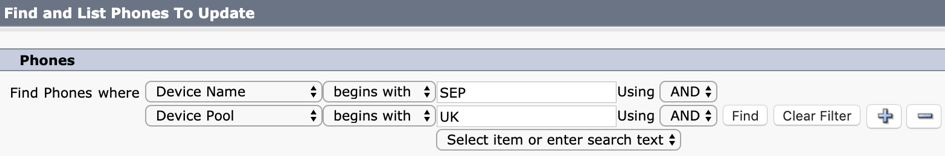

Make changes and mark checkbox

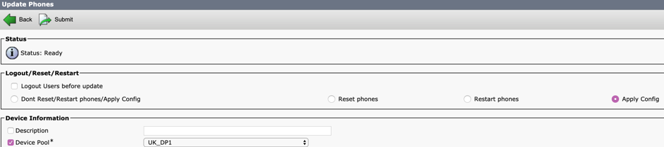

Select Run Immediately and hit Submit

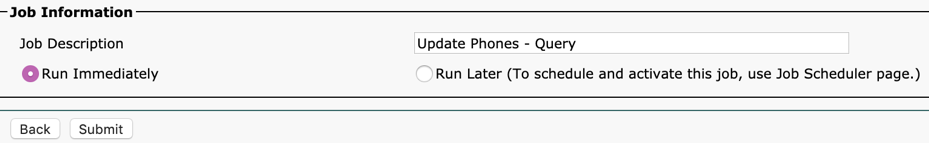

## Update Lines

#### 👉 Bulk Administration \> Phones \> Add/Update Lines \> Update Lines

Query the Lines (Directory Numbers) to update

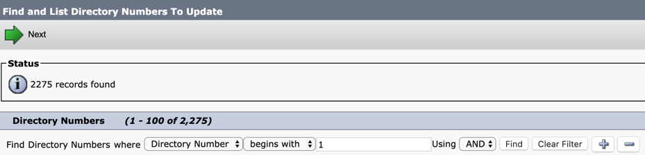

Make necessary changes, ensuring checkbox is marked

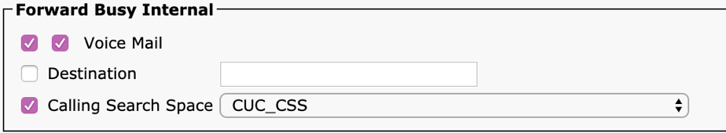

Select Run Immediately and hit Submit

## Update Users

#### 👉 Bulk Administration \> Users \> Update Users \> Query

Query the Users to update

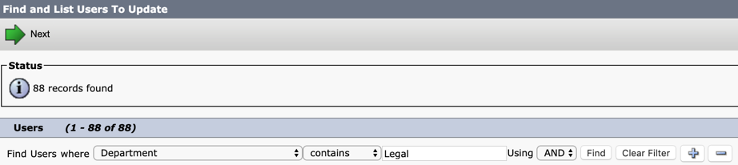

Make necessary changes, ensuring checkbox is marked

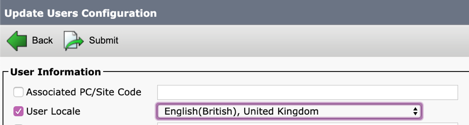

Select Run Immediately and hit Submit

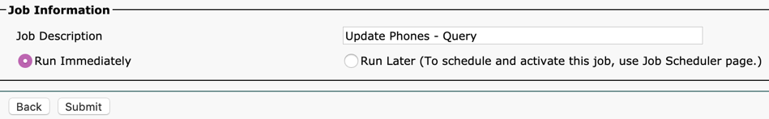

## Insert Phones

Phones are inserted using a **csv file** _against_ a **Phone Template**. Any values not included in the csv file will take on the values in the phone template. This allows for small, manageable csv files.

Each phone template has a corresponding phone csv file already created that can be downloaded, edited, and reuploaded to be used for new phones.

#### 👉 Bulk Administration \> Upload/Download Files

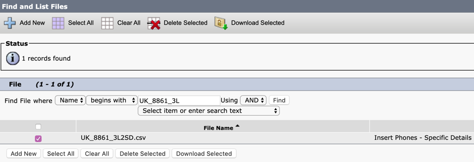

Any edits can be made in Excel and saved to a new file.

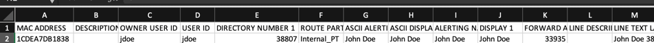

And uploaded as &quot; **Phones \> Insert Phones – Specific Details**&quot;

Now the csv file will be listed in the available File Names for _Insert Phones_

#### 👉 Bulk Administration \> Phones \> Insert Phones

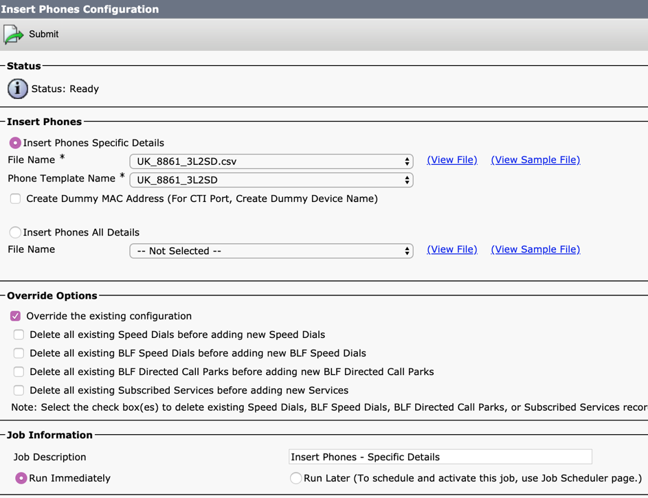

🕑 You can check on your bulk job using the **Job Scheduler**

#### 👉 Bulk Administration \> Job Scheduler

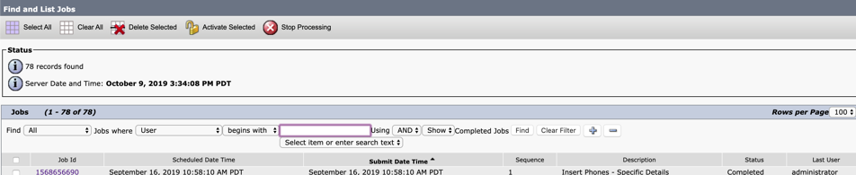

Clicking on the **Job ID** will show details. Any failures will be listed on the Log File.

Common failures are:

- Headers that don&#39;t match (are you using the correct template?)
- Extraneous characters (check number formatting)
- Unique value constraints (entity already exists in system)

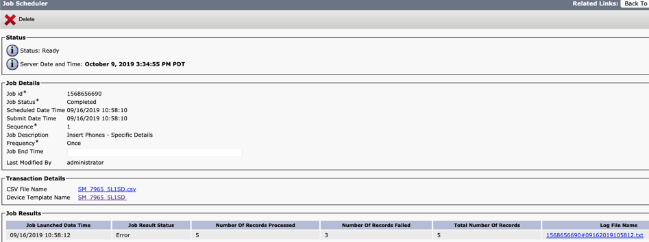

# Voicemail

## Users

Voicemail users are also synchronized from LDAP every 6 hours or manually.

New users that are synchronized must be also Imported against a **Template**

#### 👉 Users \> Import Users

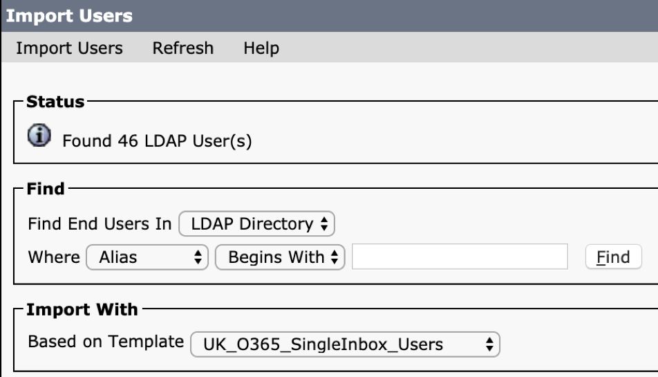

User Templates specify:

- **Time Zone** 🕑
- **Class of Service**
  - Voicemail Only
  - Unified Messaging
- **First Time Pin**
  - Edit \> Change Password \> Voicemail

## Call Handlers (Call Trees)

#### 👉 Device \> CTI Route Point

Call Handlers should have a **CTI Route Point** in CUCM with **Call Forward All** to **Voicemail** enabled. This is required to route the call to Unity Connection.

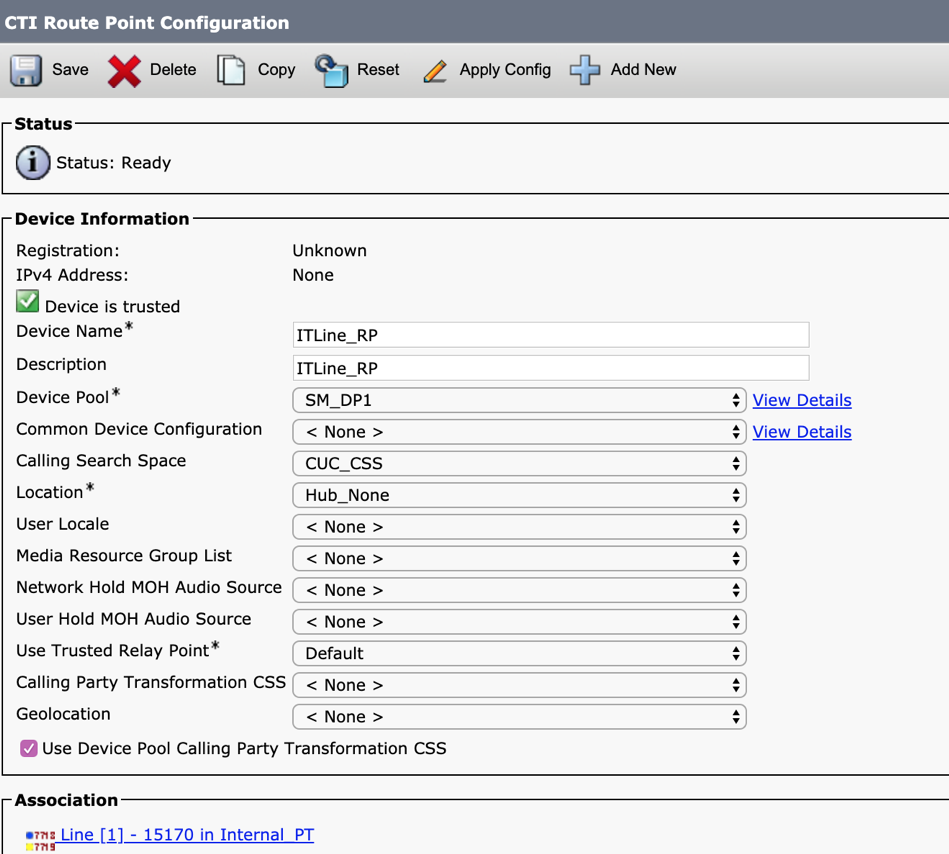

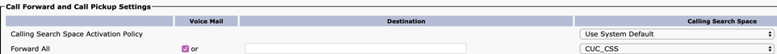

#### 👉 Unity Connection \> Call Management \> System Call Handlers

Active Schedule and Time Zone are used for 🕑 **Time of Day** routing

💫 Extension should match the directory number on the **CTI Route Point**

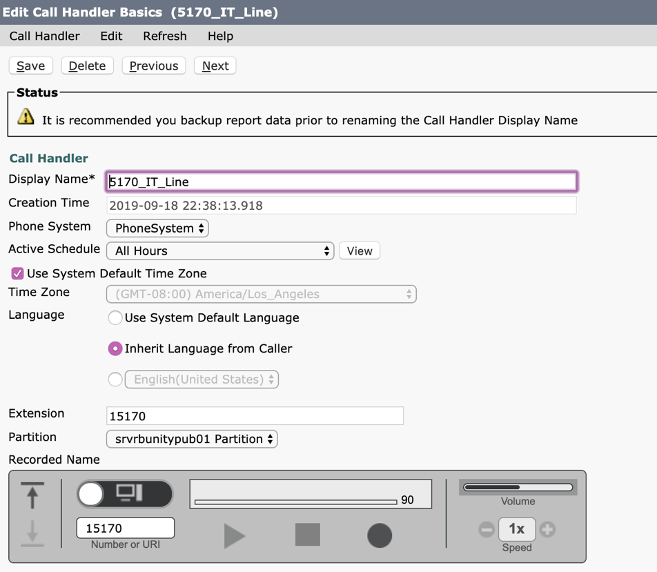

**Greetings** can be unique depending on caller, schedule, and alternate routing

💫 Standard is used for open hours and is enabled by default

#### 👉 System Call Handlers \> Edit \> Greetings

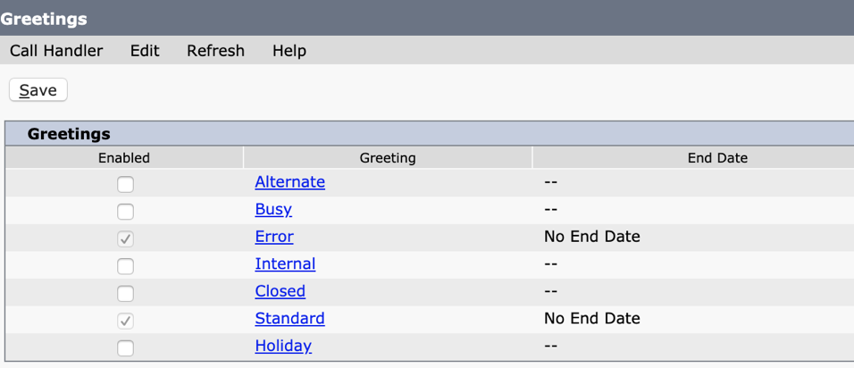

Call handlers that provide Time of Day routing-only should have **Nothing** checked,

otherwise **My Personal Greeting** specifies the recording that is uploaded below

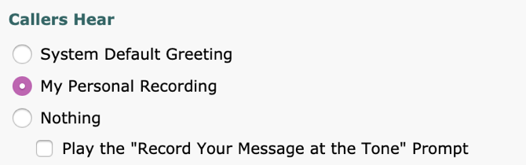

After the greeting is played, an After Greeting target should be specified to direct the call after the timeout. This is typically a **shared mailbox** or **another call handler.**

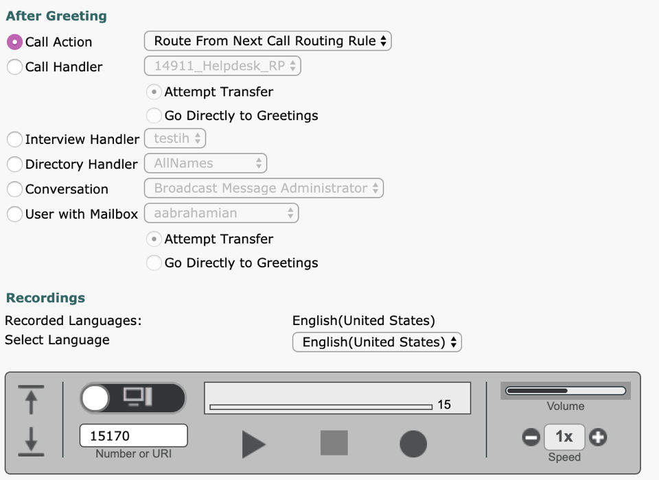

#### 👉 System Call Handlers \> Edit \> Transfer Rules

**Transfer rules** , when set to another extension, will transfer a matching call.

#### 👉 System Call Handlers \> Edit \> Caller Input

**Caller input options** specify how a call is handled after a corresponding DTMF digit is entered by the caller. Common Options are:

- **alternate contact number (any pattern),**
- **a directory handler,**
- **another call handler**
- **a mailbox.**

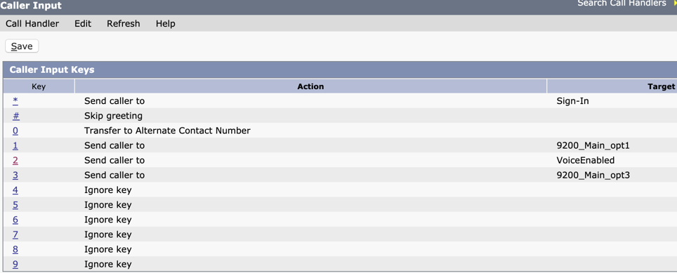